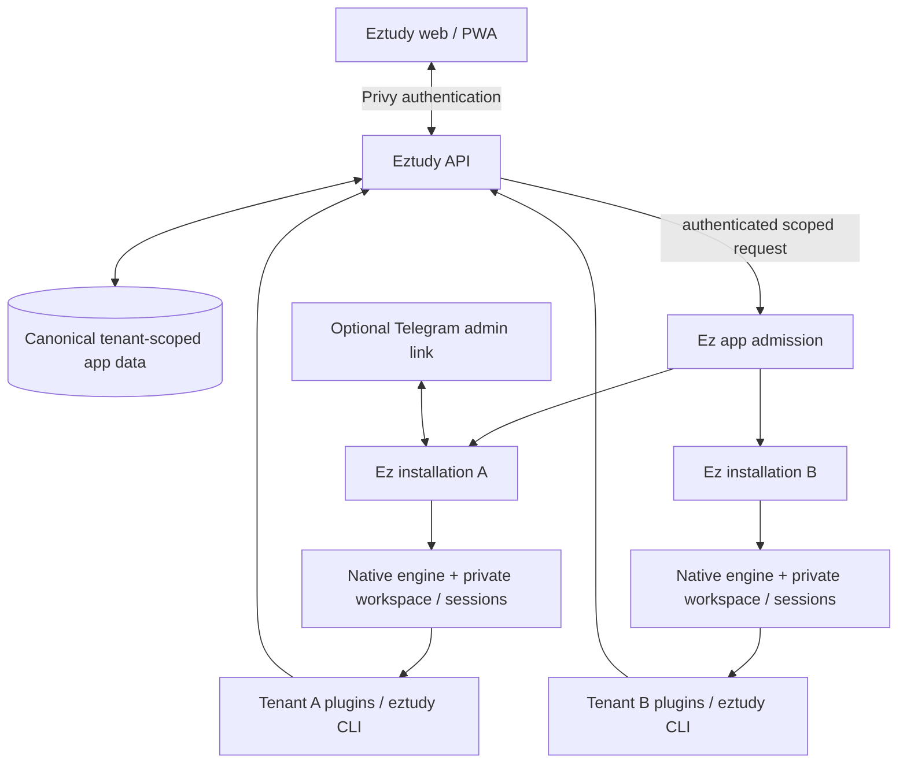

# Eztudy + Ez architecture contract

Status: target architecture and implementation benchmark.

Content-model definition: [Item publishing](item-publishing-spec.md) replaces
the legacy Session content hierarchy and defines the CLI's publishing-only
boundary. Native execution and conversation-session ownership remain unchanged.

## Purpose

Eztudy owns the learning application. Ez is the thin admission, control and
transport layer around the native agent CLI engine. The engine owns execution,
inference, native sessions, context, tools, goals, delegation and continuation.
Build one useful slice at a time.

Consume existing Ez behavior unchanged. Each change adds only its requested
capability. If integration requires changing Ez behavior, flag the
conflict before implementing; do not silently restrict capabilities or add
app-specific runtime workarounds. Generic packaging fixes belong in Ez.

Keep learner behavior and publication requirements in public product contracts.
Resolve a conflict explicitly in those contracts before implementing a different
boundary. Private planning, rollout evidence, and current-state gap analysis do
not belong in the public source tree.

## Structure



The gateway is a boundary, not a requirement for another service or container.
Use the smallest authenticated interface that satisfies it.

| Owner | Responsibilities |
| --- | --- |
| Eztudy FE | Learning UI, sign-in, provisioning status, chat, optional Telegram linking |
| Eztudy BE | Verify Privy, accounts/grants, tenant mapping, app permissions and canonical app state |
| Ez | Authorization, durable app/channel admission, session binding, scheduling, cancellation, runtime controls, secret isolation, channel delivery and receipts |
| Native engine | Execution, inference, native sessions, context, tools, goals, delegation and continuation |
| Plugins | Markdown instructions and documented CLI actions, provider connections and deterministic services |

## Tenant and provisioning

One verified Privy account → one tenant → one Ez installation.
A returning account reuses its existing tenant and installation.

```text
Privy sign-in
  → backend verifies identity
  → atomically find/create tenant and administrator membership
  → provision isolated Ez installation and required plugins
  → ready for app requests, with Telegram unlinked
```

- Provisioning is asynchronous: `provisioning / ready / failed`.
- Repeated sign-ins and retries cannot create duplicate installations.
- Provisioning failure preserves the account and a retryable provisioning record.
- The FE never chooses a tenant path, native session, credential or runtime host.
- The BE derives access from authenticated identity and server-side grants.
- Eztudy verifies Privy and supplies trusted scope through an authenticated Ez
  interface. Ez authorizes the installation binding without knowing Privy or
  Eztudy's learner model.
- Provisioning jobs may create infrastructure; they never execute agent turns.

Family/tutor access is an explicit, revocable app grant. It does
not merge tenants or give the tutor tenant-admin authority. A delegated request
retains the actual actor and the authorized learner scope; the API checks both.
Organization tenancy and fleet management are outside this contract.

## One owner, multiple authenticated channels

The tenant exists independently of Telegram. Its initial administrator is the
verified app account; Ez must accept that authority without a Telegram owner.
Ez registers one stable installation owner. Web, Telegram, phone and future
authenticated adapters are channels for that same owner, not separate owners.
Privy proves web identity to Eztudy; it is not stored as Ez's owner credential.
Eztudy resolves its server-owned account-to-installation mapping and verifies
Ez's registration. Channel registration and token rotation use the standard Ez
administration command; Eztudy never patches runtime state or commands.

- An authenticated tenant admin requests a short-lived, single-use pairing code.
- Ez verifies the Telegram user/chat and binds them to that tenant installation.
- Telegram becomes an admin channel, using standard Ez commands and controls.
- A link grants tenant administration, not permission to read every learner's
  private dialogue. Learner access still follows Eztudy's grants.
- Owner chat may explicitly follow the same native conversation across channels
  through Ez's shared-owner registration. Linking alone does not merge histories.
  Learner/Program scopes remain separate and cannot inherit owner-chat authority.
- Unlinking revokes Telegram access without deleting tenant data or app access.
- Replacing a link requires authenticated admin authority; a code cannot be reused.

## Agent turn and content path

```text
FE submits literal request + visible Program/Item reference
  → BE verifies actor, learner access and requested operation
  → Ez admits one durable run and binds the native session
  → native engine reads Markdown and calls eztudy CLI
  → API validates scope and persists canonical results
  → Ez exposes run/output receipts; the app reads them live and keeps no transcript
  → FE refreshes the canonical result
```

- Preserve user text. Add only necessary scope/channel metadata, attachments,
  quoted-message context and reply destination. Media adaptation is permitted.
- No automatic transcript replay, replacement system prompt or app-built LLM
  conversation. Native sessions own context; workspace/plugin instructions and
  explicit CLI reads complement it.
- Session binding includes tenant, actor/learner permission scope and Program
  continuity. Follow the product's conversation-reset behavior; never cross
  Programs or reuse a more privileged session for a less privileged request.
  Eztudy resolves these app concepts to an opaque binding key; Ez maps that key
  to native session state without interpreting Programs or learner roles.
- All app and Telegram turns use Ez. Eztudy has no separate agent runner,
  model-routing layer, conversation engine or competing execution queue.
- The app keeps no job/status record or transcript. It reads Ez run receipts
  live and retries admission under its original key.
- Ez supplies standard scheduling and controls; the engine decides.
- Standard Ez commands and behavior apply across channels. Document capability
  gaps separately; do not replace controls with app-specific transport branches.
- Application behavior belongs in public or purpose-built private plugin
  instructions and CLI commands. Ez does not enforce a learning workflow.
- `/goal` is native engine input. Ez does not rewrite objectives or own goals.
- Quick tutoring reads canonical content through the plugin. Explicit authoring
  requests permit scoped Markdown edits and publication through the plugin.
- Agents use the existing `eztudy` CLI for app operations. Reuse its methods;
  add commands only for a demonstrated missing action. Commands enforce
  authentication, authorization, validation and canonical persistence through
  authoritative services. Authenticated UIs and human approval flows may access
  those services directly.
- Deterministic domain jobs, provider connections and delivery queues are
  permitted when they do not take ownership of agent execution.
- Markdown/assets are authoring source. Checked, receipt-backed API projections
  are published content. Chat prose or draft files alone never mean published.
- Identity, grants, learner state and route state remain canonical in the
  API/MongoDB database, shared by development and production for an installation.
  Chat runs remain canonical in Ez. No temporary database backend, browser-local
  learner store or hardcoded identity.

## Isolation and plugins

Each tenant installation has separate writable storage, native CLI home/session
state, credentials, run admission, cancellation scope and delivery receipts.
Separate containers alone do not prove this isolation. Restricted learner/role
contexts must not gain access through a shared tenant workspace or broad token.

Executable Ez plugins use Docker packaging:

```text
Tenant A                       Tenant B
├── Ez                         ├── Ez
├── plugin services as needed  ├── plugin services as needed
└── temporary CLI containers   └── temporary CLI containers
```

- Installation does not imply every service runs continuously.
- CLI calls may launch disposable containers. Skills-only plugins need none.
- The Eztudy plugin uses scoped API access; it does not duplicate Eztudy's BE/DB.
- Credentials are enforced by the CLI/API, never selected or authorized by a
  prompt. Provider secrets remain outside the agent's general environment.
- Share services only where their explicit contract supports isolation. Do not
  assume existing plugins are safe to share across tenants.

Capacity is roughly tenants × (Ez + running plugin services), plus temporary
CLI containers and any explicitly shared services. Pooling is deferred.

## Acceptance criteria

| Boundary | Minimum acceptance |
| --- | --- |
| 1. App authority + tenant mapping | Verified sign-in resolves one installation, no Telegram required; repeat admission/provisioning creates no duplicate |
| 2. One generation flow | Explicit request → Ez → Markdown + CLI publish/readback → published content visible in authenticated FE |
| 3. Isolation | Two tenants produce separate results; cross-tenant reads, writes, session access and cancellation fail; existing delegated-access rules hold |
| 4. Optional Telegram link | Admin pairs once, a standard command works, unlink revokes access; app remains usable |
| 5. Execution ownership | App turns exclusively use Ez; no competing runner, queue or model-routing layer |

Self-service registration provisions the installation automatically and exposes
its status. Returning users reuse their existing installation.

For each piece: relevant typecheck/build, focused checks for its changed
boundary, and one real authenticated main-path QA. Broaden checks only for a
concrete unresolved risk. No speculative abstractions or exhaustive matrices.
Question the requirement, remove unnecessary behavior, then simplify existing
instructions or tool contracts before adding machinery. Scale checks to
likelihood, impact and reversibility; once they pass and boundaries hold,
complete the authorized delivery without repeated hypothetical reviews.

## Open-source shape and change gate

Keep clear FE, API, CLI/plugin, Markdown instructions and docs boundaries in the
existing repository layout. Do not reorganize folders just to match a diagram.
Document setup, configuration, the CLI contract and optional Telegram pairing.
Commit safe example configuration/content; exclude credentials, private learner
data, native sessions and deployment state. Open-source setup must have no
hardcoded personal account or private installation dependency.

Every relevant change/PR should state:

1. Which piece and boundary it implements; what it removes or simplifies.
2. Why any remaining additions are necessary.
3. The focused checks and actual user-path result, plus any capability gap.

Independent reviewers assess the final change against this contract and
distinguish material blockers from optional improvements. Passing tests do not excuse a
second runner, broken tenant isolation or publication without a receipt.
Authorization/secret exposure, data loss, architecture violations and uncertain
external writes block delivery. Minor recoverable gaps get a brief note and a
focused follow-up. Reuse existing issues and active ownership for authorized
fixes. Discovery alone does not authorize repairs, merge, release, deployment,
duplicate work or recurring audits. Progress means usable outcomes and learning
from feedback, not code volume or test count.
